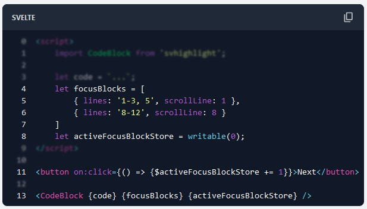
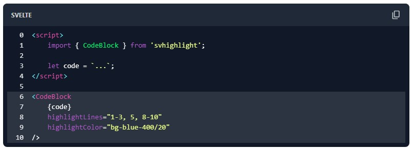

# svhighlight - A code highlighter with blur and focus buttons for SvelteKit

TODO: add npm package / number of downloads / version / etc

[Documentation]()
[Github]()

##  Features

✅ line numbers toggle
✅ highlighting lines / blur out non-highlighted lines
✅ copy button
✅ focus blocks and buttons to focus your reader's attention
✅ customizable

## Installation

```bash
pnpm i svhighlight
```

For this package you also need [highlight.js](https://www.npmjs.com/package/highlight.js?activeTab=readme):

```bash
pnpm i highlight.js
```

Additionally install [TailwindCSS](https://tailwindcss.com/docs/guides/sveltekit) to customize the component.

## Examples

### Focus Blocks


### Blur



### Highlighting

