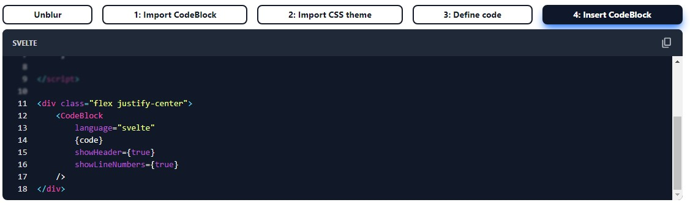

# SvHighlight

A code highlighter for Svelte, with line blur and highligthing and focus buttons. The component can be easily customized with TailwindCSS.

## Links
- [Documentation](https://svhighlight.vercel.app/)
- [Github](https://github.com/bennymi/svhighlight)

## Features

- ✅ line numbers toggle
- ✅ highlighting lines / blur out non-highlighted lines
- ✅ hovering over blurred area unblurs the code
- ✅ copy button
- ✅ focus blocks and buttons to focus your reader's attention
- ✅ customizable

## Installation

```bash
pnpm i svhighlight
```

For this package you also need [highlight.js](https://www.npmjs.com/package/highlight.js?activeTab=readme):

```bash
pnpm i highlight.js
```

Additionally install [TailwindCSS](https://tailwindcss.com/docs/guides/sveltekit) to customize the component.

## Example Screenshots

### Focus Blocks


### Blur



### Highlighting

